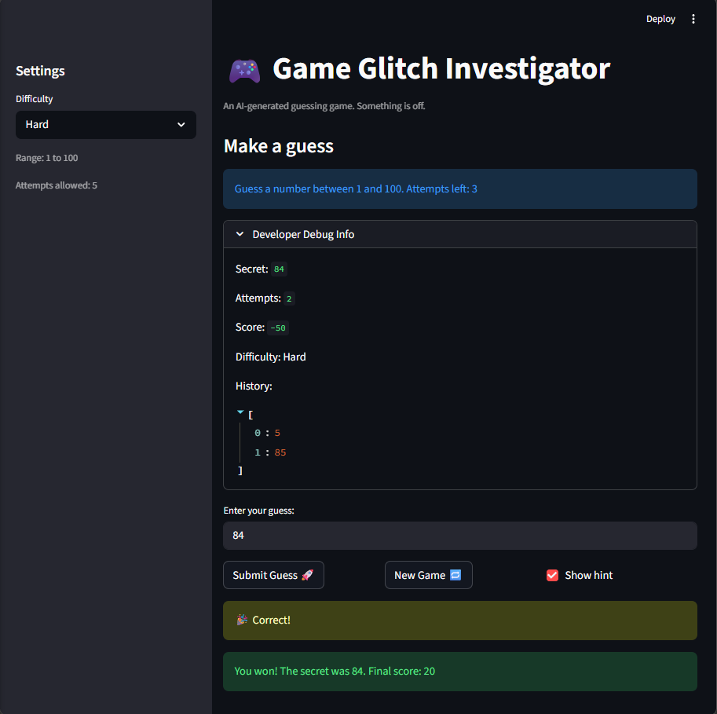
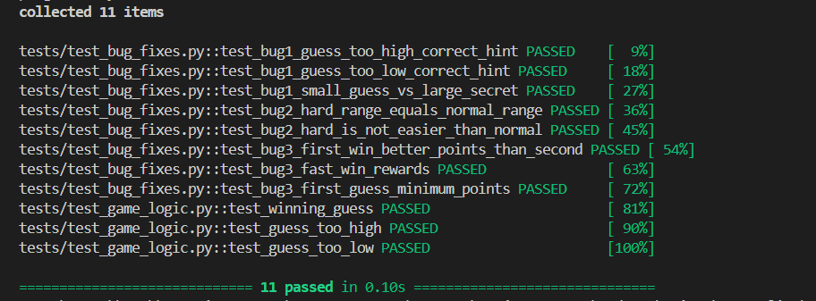

# 🎮 Game Glitch Investigator: The Impossible Guesser

## 🚨 The Situation

You asked an AI to build a simple "Number Guessing Game" using Streamlit.
It wrote the code, ran away, and now the game is unplayable. 

- You can't win.
- The hints lie to you.
- The secret number seems to have commitment issues.

## 🛠️ Setup

1. Install dependencies: `pip install -r requirements.txt`
2. Run the broken app: `python -m streamlit run app.py`

## 🕵️‍♂️ Your Mission

1. **Play the game.** Open the "Developer Debug Info" tab in the app to see the secret number. Try to win.
2. **Find the State Bug.** Why does the secret number change every time you click "Submit"? Ask ChatGPT: *"How do I keep a variable from resetting in Streamlit when I click a button?"*
3. **Fix the Logic.** The hints ("Higher/Lower") are wrong. Fix them.
4. **Refactor & Test.** - Move the logic into `logic_utils.py`.
   - Run `pytest` in your terminal.
   - Keep fixing until all tests pass!

## 📝 Document Your Experience

**Game Purpose:**
This is a number guessing game where players try to guess a secret number within a range based on their difficulty level. The game gives hints (go higher/lower) and awards points based on how quickly you win. It teaches players about Streamlit state management and debugging AI-generated code.

**Bugs Found:**
1. **Backwards Hints** - The game was telling players to "Go Higher" when they should go lower (and vice versa). This made hints useless.
2. **Broken Scoring** - Winning quickly gave fewer points instead of more points. The scoring reward system was backwards.
3. **State Reset Issue** - When you clicked "New Game", the input box still showed the old guess, and the game state wasn't fully resetting.
4. **Unfair Bonus System** - Wrong guesses had an inconsistent penalty system with confusing even/odd bonuses.

**Fixes Applied:**
1. Fixed hint messages in `check_guess()` - swapped "Go HIGHER" and "Go LOWER" logic so they match the correct direction.
2. Fixed scoring initialization - changed attempts from starting at 1 to 0, corrected the win formula to properly reward speed.
3. Added `game_counter` to reset the input field key on each new game, forcing Streamlit to clear cached widgets.
4. Removed even/odd bonus inconsistency - now all wrong guesses give a consistent -5 penalty.
5. Added proper state reset in the "New Game" button to clear history, status, and attempts.

## 📸 Demo

**Fixed Game - Winning Screenshot:**

**Pytest Results - All Tests Passing:**

## 🚀 Stretch Features

- [ ] [If you choose to complete Challenge 4, insert a screenshot of your Enhanced Game UI here]
